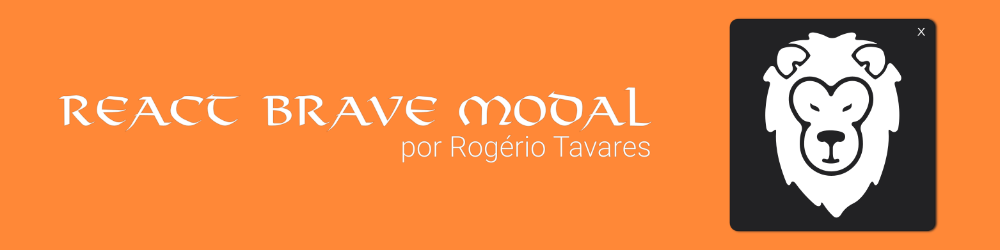

<h1 align="center">Bem-vindo ao React Brave Modal!</h1>
<p align="center">"A mente que se abre a uma nova idéia jamais voltará ao seu tamanho original."<br>Albert Einstein</p>

<p align="center">
	
	
	
</p>

Oi, Sou um React Hook que faz você criar modals de forma rápida e customizável! Se você quiser aprender a usar o RBM, pode me ler. Se você quiser ajudar a melhorar o RBM, pode mandar um pull request. Depois de terminar de ler essa documentação você poderá criar modals incríveis e customizáveis com poucas linhas de código.

## Índice 

 - :bulb: [O que o RBM pode fazer?](#bulb-o-que-o-rbm-pode-fazer)
 - :anchor: [Como instalar?](#anchor-como-instalar)
 - :space_invader: [Como implementar?](#space_invader-como-implementar)
 - :neckbeard: [Como usar?](#neckbeard-como-usar)
	 - [Propriedades do "showModal"](#propriedades-do-showmodal)
		 - [Type](#type)
		 - [Data](#data)
		 - [Title](#title)
		 - [Text](#text)
 - :sunglasses: [Exemplos](#sunglasses-exemplos)
 - :briefcase: [Como contribuir?](#briefcase-como-contribuir)
 - :panda_face: [Finalizando](#panda_face-finalizando)

## :bulb: O que o RBM pode fazer?

O RBM pode criar modals usando react hooks no ReactJS de uma forma bastante simples.

## :anchor: Como instalar?

O primeiro passo é instalar o nosso pacote no seu package.json com o comando abaixo

Via NPM
```bash
npm i react-brave-modal    
```
Via Yarn
```bash
yarn add react-brave-modal
```

## :space_invader: Como implementar?

Primeiramente você precisa saber que o RBM funciona de forma global na sua aplicação, você precisa colocar o "***ModalProvider***" por volta das rotas que você pensa em usar os seus modals. 
Normalmente eu coloco por volta de todas as rotas para que fique mais fácil de mostrar um modal sempre que você precisar.
Abaixo mostro um exemplo de como fazer

    import React from  'react';
	import { BrowserRouter } from  'react-router-dom';
	import { ModalProvider } from  'react-brave-modal'; // Importação do módulo
	
	import Routes from  './routes';

	const  App:  React.FC  = () => (
		<BrowserRouter>
			<ModalProvider> // Acrescentando o Provider por volta de todas as rotas
				<Routes  />
			</ModalProvider>
		</BrowserRouter>
	);
	
	export  default  App;

## :neckbeard: Como usar?

Pronto! Chegamos na parte mais legal dessa documentação.
Se você já conhece React-hooks será a coisa mais simples que você já fez.
Se não, recomento que você leia um pouco sobre [React-hooks](https://pt-br.reactjs.org/docs/hooks-intro.html) antes de continuar.

Continuando, você precisa importar o "*useModal*" para poder usar o "*showModal*" e o "*stopModal*" dentro do seu componente.
Abaixo mostro um exemplo de como fazer

    import React from 'react';

	import { useModal } from 'react-brave-modal';

	const Home: React.FC = () => {
	  const { showModal } = useModal();

	  return (
	  <>
	    <h1>React Brave Modal</h1>
	    <div>
	      <button 
		      type="button" 
		      onClick={() => showModal(
			    { 
				  type:'simple', 
				  title: 'Meu Título Bonitão', 
				  text: 'Meu texto legal'
				}
				)
			  }>
				  Show Simple
			  </button>
	    </div>
	  </>
	  );
	};

	export default Home;

### Propriedades do "showModal"

#### Type
É onde você descreve o tipo do seu modal.
Têm como valores permitidos: "***simple***" e "***full***".
#### Data
Essa propriedade deve ser usada quando você precisar colocar um componente dentro do modal.
Permite apenas Componentes do tipo "***React.FC***".
#### Title
Essa propriedade deve ser usada quando você quiser usar um titulo dentro do seu modal.
Permite apenas "***string***".
#### Text
Essa propriedade deve ser usada quando você quiser usar um texto dentro do seu modal.
Permite apenas "***string***".

## :sunglasses: Exemplos
Dentro da pasta do projeto você pode encontrar uma pasta chamada "***example***", essa pasta contem um projeto base com o RBM instalado e funcionando.
Para executar esse projeto você precisa executar os seguintes comandos no seu terminal
```js
	   # Clonar o repositório
	   ❯ https://github.com/rogertavaress/react-brave-modal.git
	   
	   # Entrar no diretório
	   ❯ cd react-brave-modal/example
	   
	   # Instalar as dependências
	   ❯ yarn
	   
	   # Iniciar o projeto
	   ❯ yarn start
```
## :briefcase: Como contribuir?
1.  Faça o  _fork_  do projeto ([https://github.com/rogertavaress/react-brave-modal](https://github.com/rogertavaress/react-brave-modal))
2.  Crie uma  _branch_  para sua modificação (`git checkout -b feature/fooBar`)
3.  Faça o  _commit_  (`git commit -am 'Add some fooBar'`)
4.  _Push_  (`git push origin feature/fooBar`)
5.  Crie um novo  _Pull Request_

## :panda_face: Finalizando
Gostaria de agradecer por você ter chegado até aqui!
Se você utilizar o projeto ou quiser trocar uma ideia sobre, pode me enviar um direct no [LinkedIn](https://www.linkedin.com/in/rogertavaress).
